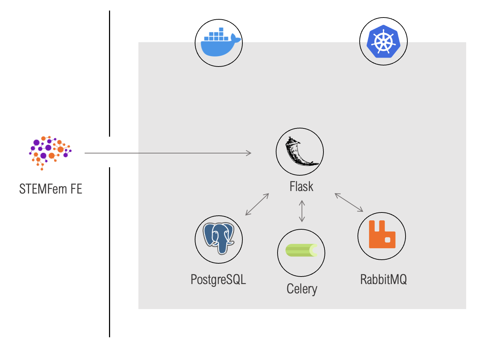

# STEMFem

Backend code for STEMFem web.

## Contents

1. [The architecture](#the-architecture)
1. [Getting started](#getting-started)
1. [Built with](#built-with)


## The architecture



## Getting started

These instructions will get you a copy of the project up and running on your local machine for development and testing purposes. See deployment for notes on how to deploy the project on a live system.

### Prerequisites

What things you need to install the software and how to install them

[Docker Desktop](https://docs.docker.com/docker-for-mac/install/) is required to run the software

### Installing

A step by step series of examples that tell you how to get a development env running

To run, go into the directories of the micro-services (/src) and ensure that the modules are installed (see README.md in each directory)

In each subdirectory, run

```bash
pip install -r requirement.txt
```

To start, run in the main directory,

```bash
sudo docker-compose up
```

To deploy on kubernetes, run

```bash
docker stack deploy --orchestrator=kubernetes -c docker-compose.yml words
```

If kubernetes is unable to be deployed, just run on docker using sudo docker-compose up

## Built with

* PostgreSQL - The object-relational database used
* RabbitMQ - The message-broker used for celery
* Flask - The web framework used
* Celery - The asynchronous task queue
